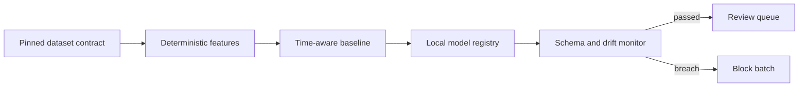

# Education finance MLOps

A reproducible MLOps reference for municipality-year educational-finance indicator anomaly triage. It trains a transparent peer-group baseline, records dataset, code, and model lineage, checks drift before scoring, and produces a human review queue. It does not rank schools, assess people, allocate resources, or make eligibility, fraud, or policy-quality decisions.



## What runs today

The repository uses a small, synthetic municipality-year fixture. It proves the execution path without claiming that a public Kaggle education release already exists. The fixture is deliberately limited and must not support any real-world conclusion.

- Dataset contracts validate a pinned source, version, manifest hash, and schema version.
- Features use only same-period municipality-year values.
- A regional z-score baseline trains on prior years and evaluates a later year.
- The registry records model parameters, evaluation output, dataset pin, and code revision.
- Drift checks block scoring when key feature means shift beyond the configured limit.
- Scores are review signals with evidence values and an explicit decision prohibition.

## Quick start

```powershell
make check
python -m education_finance_mlops train --data data\municipality_year_fixture.json --registry artifacts\model.json --train-through-year 2023 --evaluation-year 2024 --code-revision local
python -m education_finance_mlops score --data data\municipality_year_fixture.json --reference-data data\municipality_year_fixture.json --registry artifacts\model.json --output artifacts\review_queue.json
```

The final command writes a local JSON review queue. `artifacts/` is ignored by Git.

## Dataset boundary

The intended production input is a reviewed and pinned version of `brazil-education-data-lake`, distributed separately through Kaggle. This repository does not contain a Kaggle credential, downloader, or public-data release. Until that dataset exists and its manifest has been reviewed, the fixture remains the only supported input.

PNCP is not a model feature in this first case. Procurement value and education expenditure are different concepts, and the project will not infer one from the other.

## Safety boundary

The output identifies municipality-year patterns that differ from training peer patterns. A review signal is not a finding of fraud, error, causality, quality, eligibility, or priority. A person must inspect the source context before any action.

Read the full [model card](docs/model-card.md) and [data contract](docs/data-contract.md).

## Testing

The test suite validates the time-aware split, deterministic review-signal behavior, drift blocking, and model-registry lineage. CI runs the same tests on every push.

## Article draft

[Building a traceable MLOps pipeline for public education-finance indicators](articles/traceable-mlops-for-public-education-finance.md) is an English Markdown draft for later manual publication. Its [claim-to-evidence map](articles/claim-map.md) keeps the prose within the demonstrated result.

## License

[Apache-2.0](LICENSE).
