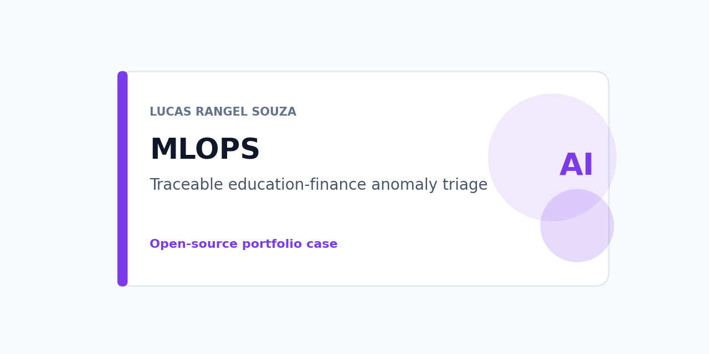
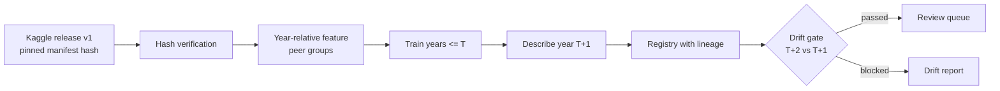

# Education finance MLOps



A reproducible MLOps reference for anomaly triage on Brazilian municipal education-finance declarations. It reads a pinned public Kaggle release, trains a transparent peer-group model on earlier years, describes a held-out year, records dataset, code, and model lineage, blocks a batch when its distribution drifts, and writes a queue for human review. It does not rank schools, assess people, allocate resources, or make eligibility, fraud, or policy-quality decisions.

## Architecture



*Alt text: the pinned release is verified and turned into year-relative features; the model trains on earlier years, describes the next year, is registered with lineage, and scores a later batch only if the drift gate passes; otherwise it writes a drift report.*

## Capabilities and non-goals

- Resolver pinned to `lucasrangelss/brazil-education-data-lake` version 1 with manifest and per-file SHA-256 checks ([release.py](education_finance_mlops/release.py)).
- Robust peer model on investment per basic-education student divided by the same-year national median; macro-region x population-band groups; global baseline stored beside it ([peer_model.py](education_finance_mlops/peer_model.py), [model card](docs/model-card.md)).
- Drift gate on schema, missingness, PSI, median shift, and MAD spread ratio ([release_drift.py](education_finance_mlops/release_drift.py), [ADR 0002](docs/adr/0002-year-relative-feature-and-spread-gate.md)).
- Registry and queue files carrying dataset version, manifest hash, data build commit, code commit, feature schema, model ID, and intended use ([release_pipeline.py](education_finance_mlops/release_pipeline.py)).
- Intended-use guard: only `review_triage`; allocation, eligibility, sanction, audit-finding, and ranking are refused.
- The original synthetic fixture path (`train`, `score`) remains for offline demonstration.

Not provided: accuracy claims (no labels exist), causal explanations, a serving API, PNCP features (procurement value is not education expenditure).

## Quick start

Python 3.10 or later. The dataset is public; no Kaggle account is needed.

```powershell
python -m pip install -e ".[release]"
make check
make reproduce
```

`make reproduce` runs two configurations. The 2022 batch is scored and writes `artifacts/release-v1-2022/review_queue.json` with 96 signals. The 2023 batch is blocked by the drift gate, exits with code 2, and writes `artifacts/release-v1-2023/drift_report.json`; the Makefile tolerates that exit. Pass `--release-dir` to use a local copy of the dataset; verification still applies.

## Repository structure

```text
education_finance_mlops/  resolver, features and peer model, drift gate, pipeline, CLI
data/                     synthetic fixture for the offline path
tests/                    fixture and release-path tests (temporary Parquet, no network)
docs/                     model card, data contract, ADRs, dated evidence
articles/                 article source and claim map
```

## Data, licensing, and privacy

Input: FNDE SIOPE annual municipal declarations 2019-2023 joined to IBGE codes, published as a reviewed Kaggle derivative under the `other` setting with credit to FNDE and IBGE. No personal data. Apache-2.0 covers this code, not the data.

## Evaluation

Time-aware: train through T, describe T+1, score T+2. From the [2026-09-25 run](docs/evidence/education-release-v1-run-2026-09-25.md):

| Configuration | Held-out year signals (peer / global) | Drift on scored year | Outcome |
|---|---|---|---|
| train 2019-2020, describe 2021, score 2022 | 93 (1.67%) / 15 | PSI 0.029, spread 1.086 | 96 signals |
| train 2019-2021, describe 2022, score 2023 | 89 (1.60%) / 24 | PSI 0.233, spread 1.384 | blocked |

Without labels, these are rates and slices, not accuracy.

## Testing and CI

`make check` runs 16 unit tests covering release verification, time boundaries, determinism, drift blocking (distribution shape, missingness, schema, spread), and the intended-use guard. CI runs them on every push.

## Deployment

None. The pipeline is a batch CLI. The runtime lab's public demo may show a pinned output later; this repository contains no deployment configuration.

## Trade-offs and limitations

Declared values are not audited. The peer definition ignores rural/urban structure and enrollment mix. Thresholds follow convention (robust z 3.5, spread 1.25). The cause of the 2023 spread change is unknown.

## Security and responsible use

Every queue entry carries `human_review_required` and `decision_prohibited`. No credential is used or stored. See [SECURITY.md](SECURITY.md).

## Replication and evidence

Run `make reproduce` twice and compare SHA-256 values; at commit `6be582d` the registry and queue files matched the hashes in the run record.

## Articles

[Building a traceable MLOps pipeline for public education-finance indicators](articles/traceable-mlops-for-public-education-finance.md), with its [claim-to-evidence map](articles/claim-map.md). Draft; not yet published elsewhere.

## Roadmap

- Investigate the 2023 dispersion change before refitting on 2023.
- Add enrollment-mix peer features once a reviewed Censo Escolar aggregate is in the data release.
